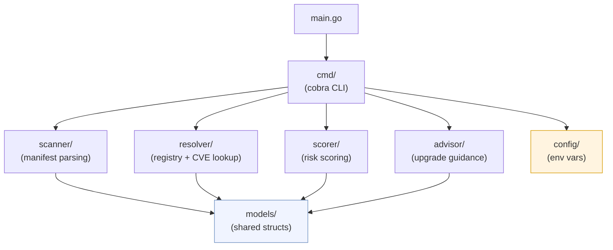
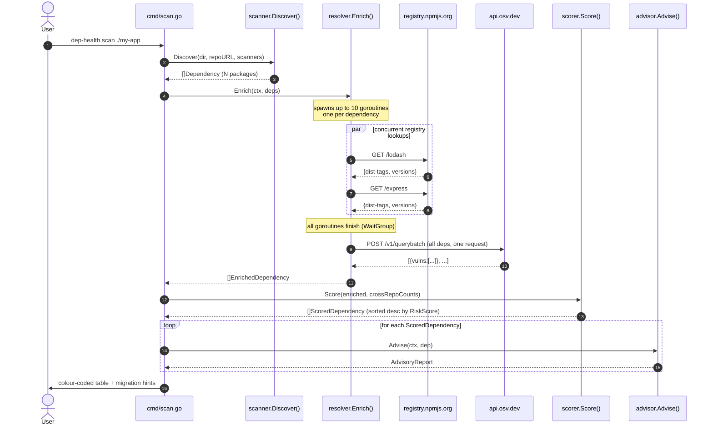
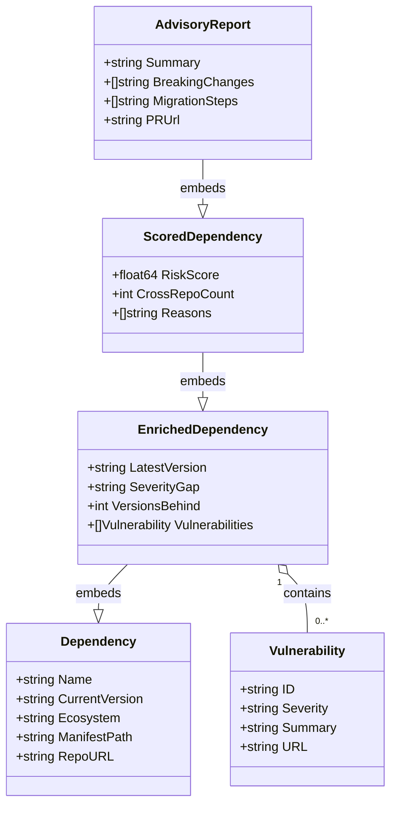
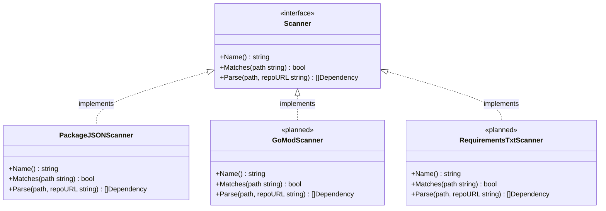
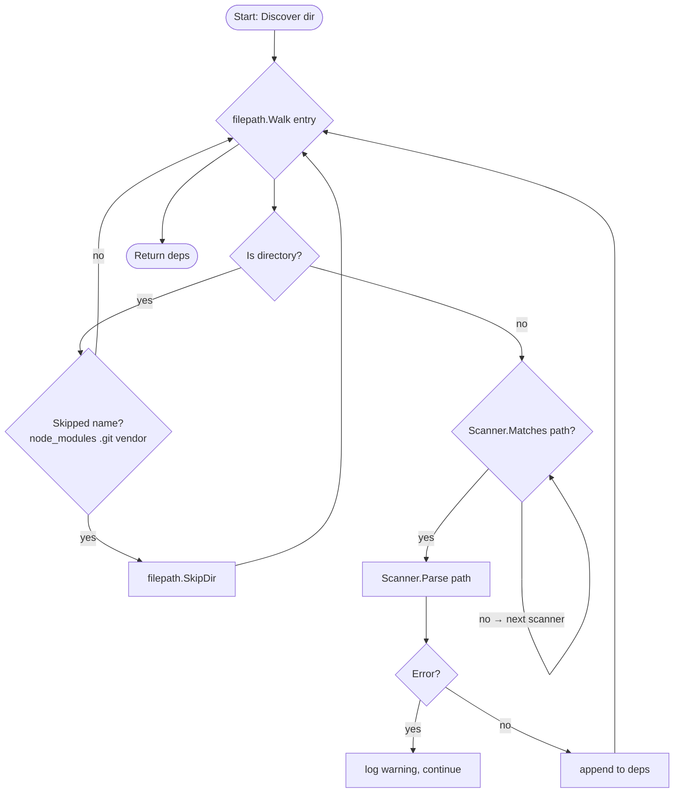
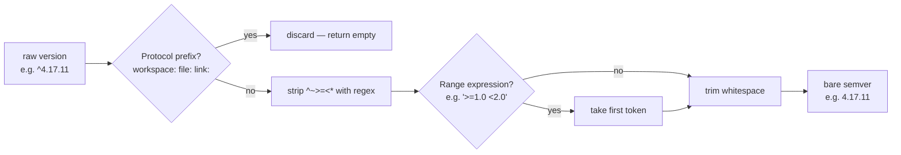
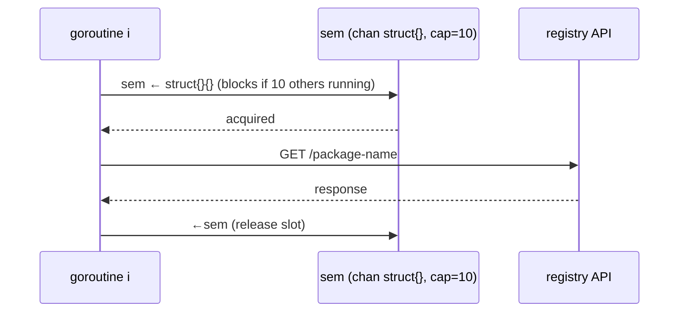
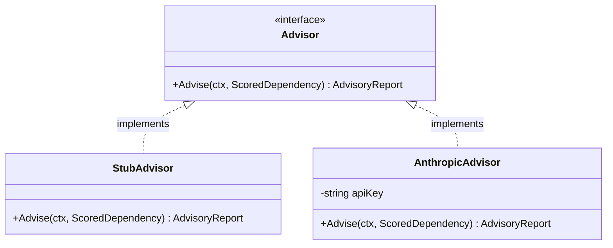
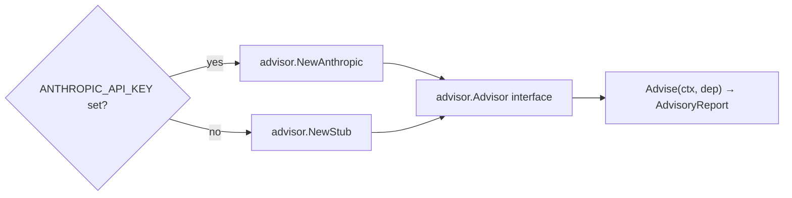

# dep-health — Architecture

This document covers the internal design of dep-health: package responsibilities, data flow, concurrency model, the risk-scoring formula, and the extension points for adding new ecosystems and advisors.

---

## Table of contents

1. [Package dependency graph](#1-package-dependency-graph)
2. [End-to-end pipeline](#2-end-to-end-pipeline)
3. [Data model](#3-data-model)
4. [Scanner package](#4-scanner-package)
5. [Resolver package — concurrency model](#5-resolver-package--concurrency-model)
6. [Scorer package — risk formula](#6-scorer-package--risk-formula)
7. [Advisor package](#7-advisor-package)
8. [External API contracts](#8-external-api-contracts)
9. [Extension guide](#9-extension-guide)

---

## 1. Package dependency graph

The dependency graph is strictly layered — no import cycles are possible.



**Rule:** only `cmd/` may import all other packages. Domain packages (`scanner`, `resolver`, `scorer`, `advisor`) import only `models`. No domain package imports another domain package.

---

## 2. End-to-end pipeline

The `dep-health scan <dir>` command runs five sequential stages. Registry lookups inside Stage 2 are parallelised; everything else is single-threaded.



---

## 3. Data model

Each pipeline stage produces a richer struct by embedding the previous one. This keeps the type system honest — you can never pass a `ScoredDependency` where a raw `Dependency` is expected, but you can always access the raw fields through the embedding chain.



**Embedding chain:** `Dependency` → `EnrichedDependency` → `ScoredDependency` → `AdvisoryReport`

Every struct exposes all fields of its ancestors via Go struct embedding. Callers that only need version data work with `EnrichedDependency`; the full `AdvisoryReport` is only materialised at the very end.

---

## 4. Scanner package

The `Scanner` interface is the single extension point for manifest parsers.



### Discovery walk



### Version string normalisation

Range operators are stripped from version specifiers before any semver comparison occurs. The logic lives in `cleanVersion()`.



---

## 5. Resolver package — concurrency model

The resolver uses two distinct parallelism strategies to maximise throughput while being respectful to external APIs.

```mermaid
flowchart TD
    A([Enrich called with N deps]) --> B[Create semaphore\nchan size = Concurrency]

    B --> C[Launch N goroutines]

    subgraph goroutines ["goroutines (up to Concurrency run at once)"]
        direction LR
        G1["goroutine 1\nresolveNPM(dep[0])"]
        G2["goroutine 2\nresolveNPM(dep[1])"]
        GN["goroutine N\nresolveNPM(dep[N])"]
    end

    C --> goroutines
    goroutines --> D[WaitGroup.Wait — all finish]
    D --> E["enrichVulnerabilities()\none batch POST to OSV.dev"]
    E --> F([Return []EnrichedDependency])
```

**Why two phases?**

- Registry lookups (npm, PyPI, etc.) are independent per package and benefit maximally from parallelism. A semaphore cap (`defaultConcurrency = 10`) prevents connection exhaustion.
- OSV.dev accepts a batch request — sending all packages in one POST is cheaper than N individual calls and avoids hitting rate limits.

### Semaphore pattern



---

## 6. Scorer package — risk formula

Each dependency is scored across four independent signals. Scores are normalised to 0–1 per factor, then combined using fixed weights.


### Score band interpretation

| Score | Band | Colour | Typical profile |
|---|---|---|---|
| 70–100 | Critical | Red / bold | CRITICAL or HIGH CVE present |
| 40–69 | Elevated | Yellow | Major version lag or HIGH CVE |
| 0–39 | Low | Green | Patch/minor lag, no CVEs |

### Sorting

`scorer.Score()` returns `[]ScoredDependency` sorted descending by `RiskScore`. The table always shows the highest-risk package first regardless of the order dependencies appear in the manifest.

---

## 7. Advisor package

The advisor is designed for easy swapping between the stub and a real API-backed implementation.



### Selection logic in `cmd/scan.go`



### Stub output

The stub generates deterministic guidance from metadata alone — no network calls:

- **Summary** — `"Upgrade {name} from {current} to {latest}. Risk score: {n}/100."`
- **BreakingChanges** — populated only for major-version gaps
- **MigrationSteps** — ecosystem-appropriate shell commands (`npm install`, `go get`, `pip install --upgrade`)

### AnthropicAdvisor (planned)

When implemented, `AnthropicAdvisor.Advise` will:

1. Build a prompt including the package name, version delta, CVE summaries, and changelog URL
2. Call `POST /v1/messages` with `claude-sonnet-4-6` (or configurable model)
3. Parse the response into `Summary`, `BreakingChanges`, and `MigrationSteps`
4. Return the populated `AdvisoryReport`

Wire it up using the `/claude-api` skill or the `github.com/anthropics/anthropic-sdk-go` package.

---

## 8. External API contracts

### npm Registry

| | |
|---|---|
| **Endpoint** | `GET https://registry.npmjs.org/{package}` |
| **Auth** | None required for public packages |
| **Used fields** | `dist-tags.latest` (latest stable version), `versions` map (all published versions for counting) |
| **Rate limit** | Informal; 10-connection semaphore keeps dep-health well within normal bounds |

### OSV.dev Batch API

| | |
|---|---|
| **Endpoint** | `POST https://api.osv.dev/v1/querybatch` |
| **Auth** | None |
| **Request** | `{"queries":[{"package":{"name":"lodash","ecosystem":"npm"},"version":"4.17.11"},…]}` |
| **Response** | `{"results":[{"vulns":[{"id":"GHSA-…","summary":"…","database_specific":{"severity":"HIGH"},…}]}]}` |
| **Alignment** | `results[i]` corresponds exactly to `queries[i]` — index alignment is preserved |
| **Severity source** | Prefer `database_specific.severity`; fall back to `severity[0].score` (CVSS string) |

---

## 9. Extension guide

### Adding a new ecosystem scanner

1. Create a file in `scanner/`, e.g. `scanner/gomod.go`
2. Implement the three `Scanner` interface methods
3. Register it in `DefaultScanners()`

```go
// scanner/gomod.go
package scanner

import "dep-health/models"

type GoModScanner struct{}

func (s *GoModScanner) Name() string               { return "go/go.mod" }
func (s *GoModScanner) Matches(path string) bool   { return filepath.Base(path) == "go.mod" }
func (s *GoModScanner) Parse(path, repoURL string) ([]models.Dependency, error) {
    // parse go.mod, return []models.Dependency with Ecosystem: "go"
}
```

```go
// scanner/scanner.go — DefaultScanners
func DefaultScanners() []Scanner {
    return []Scanner{
        &PackageJSONScanner{},
        &GoModScanner{},         // add here
    }
}
```

The resolver, scorer, and advisor pipeline picks it up automatically. You may also need to add a registry lookup branch in `resolver.resolveOne()` for the new ecosystem.

### Adding a new registry lookup

In `resolver/resolver.go`, extend `resolveOne()`:

```go
func (r *Resolver) resolveOne(ctx context.Context, dep models.Dependency) (models.EnrichedDependency, error) {
    switch dep.Ecosystem {
    case "npm":
        return r.resolveNPM(ctx, dep)
    case "go":
        return r.resolveGoProxy(ctx, dep)   // add your implementation
    default:
        return models.EnrichedDependency{Dependency: dep}, nil
    }
}
```

### Wiring the real Anthropic advisor

```go
// advisor/anthropic.go
func (a *AnthropicAdvisor) Advise(ctx context.Context, dep models.ScoredDependency) (models.AdvisoryReport, error) {
    client := anthropic.NewClient(a.apiKey)

    prompt := buildPrompt(dep) // construct from dep metadata + CVE summaries

    msg, err := client.Messages.New(ctx, anthropic.MessageNewParams{
        Model:     anthropic.F(anthropic.ModelClaudeSonnet4_6),
        MaxTokens: anthropic.F(int64(1024)),
        Messages: anthropic.F([]anthropic.MessageParam{
            anthropic.NewUserMessage(anthropic.NewTextBlock(prompt)),
        }),
    })
    if err != nil {
        return models.AdvisoryReport{}, err
    }

    return parseAnthropicResponse(dep, msg.Content[0].Text), nil
}
```

See the `/claude-api` skill for a complete working example with the Anthropic Go SDK.
