# dep-health — Architecture

This document covers the internal design of dep-health: package responsibilities, data flow, concurrency model, the risk-scoring formula, peer conflict detection, persistence, and the HTTP server/dashboard.

---

## Table of contents

1. [Package dependency graph](#1-package-dependency-graph)
2. [End-to-end pipeline](#2-end-to-end-pipeline)
3. [Data model](#3-data-model)
4. [Scanner package](#4-scanner-package)
5. [Resolver package — concurrency model](#5-resolver-package--concurrency-model)
6. [Scorer package — risk formula and conflict detection](#6-scorer-package--risk-formula-and-conflict-detection)
7. [Advisor package](#7-advisor-package)
8. [Pipeline package](#8-pipeline-package)
9. [Store package — SQLite persistence](#9-store-package--sqlite-persistence)
10. [Server and dashboard](#10-server-and-dashboard)
11. [External API contracts](#11-external-api-contracts)
12. [Extension guide](#12-extension-guide)

---

## 1. Package dependency graph

The dependency graph is strictly layered — no import cycles are possible.

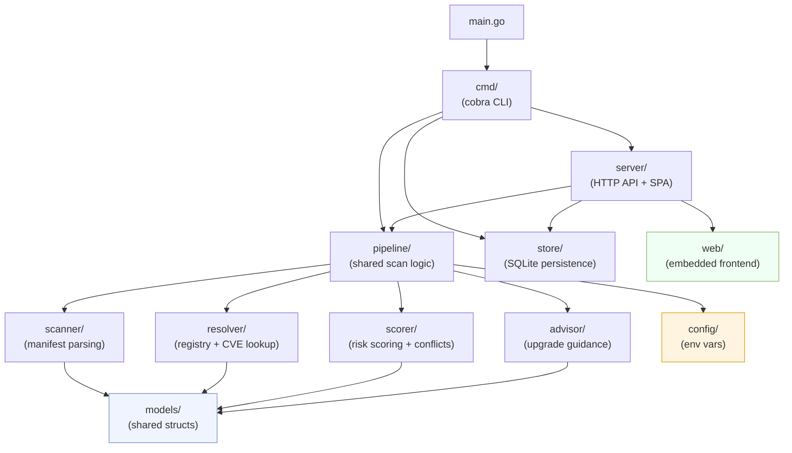

**Rule:** only `cmd/` and `server/` may import multiple domain packages. Domain packages (`scanner`, `resolver`, `scorer`, `advisor`) import only `models`. `pipeline` orchestrates them but does not import `server` or `store`.

---

## 2. End-to-end pipeline

The pipeline is shared between the CLI and the HTTP server via `pipeline.Run()`. An optional clone step prepends the sequence when a `GitURL` is provided.

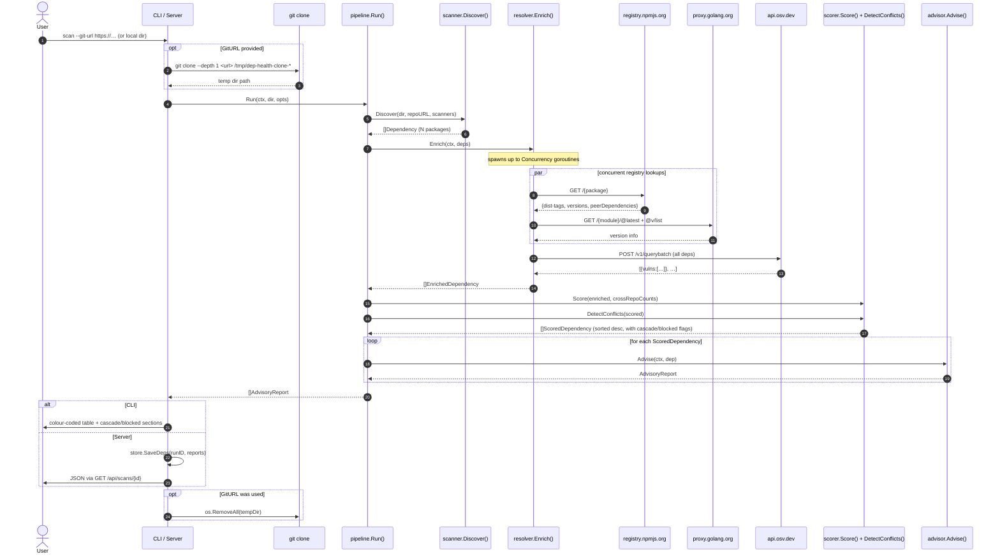

---

## 3. Data model

Each pipeline stage produces a richer struct by embedding the previous one. All structs carry JSON tags for API serialisation and `--json` output.

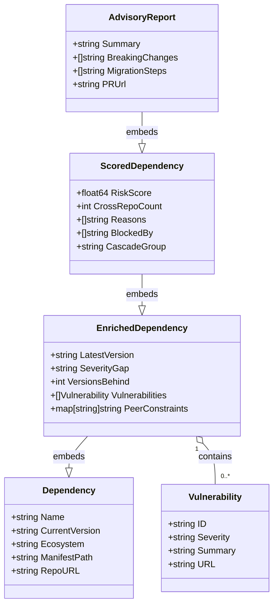

**Embedding chain:** `Dependency` → `EnrichedDependency` → `ScoredDependency` → `AdvisoryReport`

`PeerConstraints` is populated for npm packages and maps peer package names to the semver constraint declared by the package's *latest* version (e.g. `{"react": "^19.0.0"}`). It drives conflict detection in the scorer.

---

## 4. Scanner package

The `Scanner` interface is the single extension point for manifest parsers.

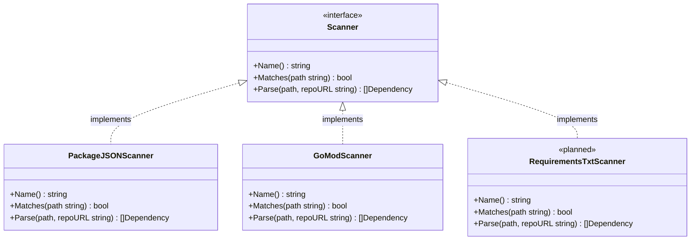

### Discovery walk

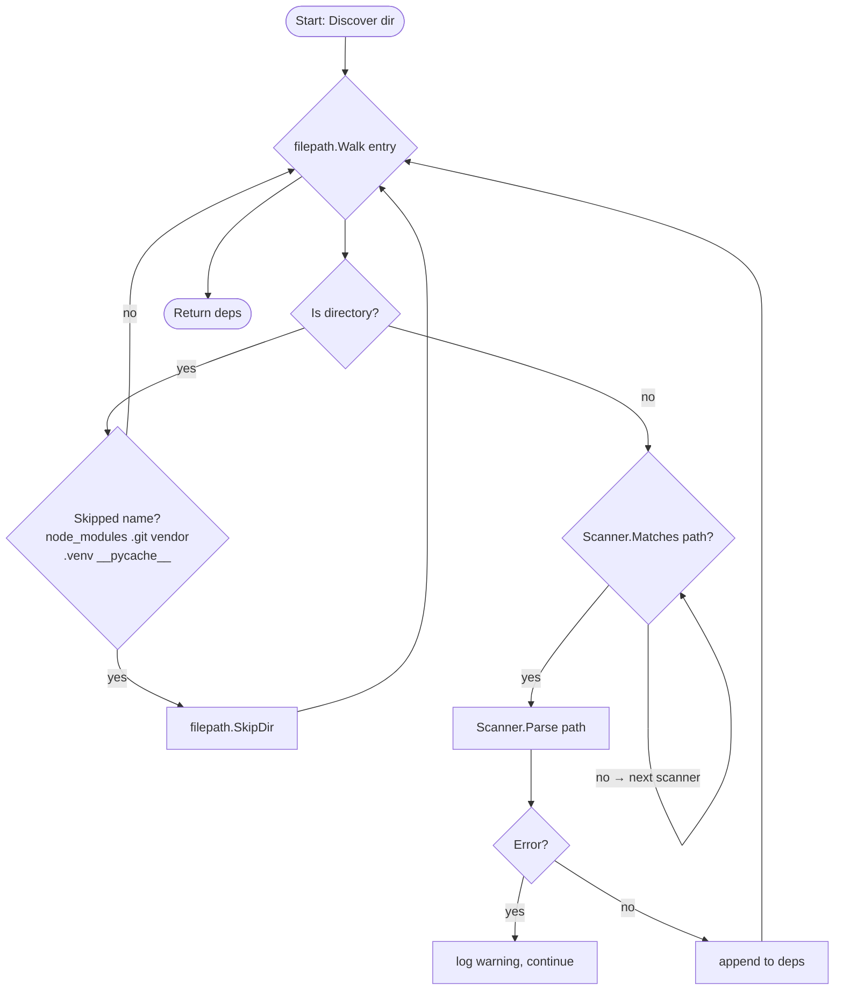

### Version string normalisation

Range operators are stripped before any semver comparison. The logic lives in `cleanVersion()`.

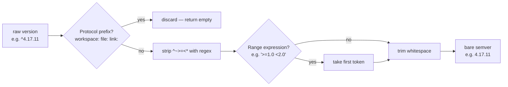

---

## 5. Resolver package — concurrency model

The resolver uses two distinct parallelism strategies to maximise throughput while being respectful to external APIs.

```mermaid
flowchart TD
    A([Enrich called with N deps]) --> B[Create semaphore\nchan size = Concurrency]

    B --> C[Launch N goroutines]

    subgraph goroutines ["goroutines (up to Concurrency run at once)"]
        direction LR
        G1["goroutine 1\nresolveNPM(dep[0])"]
        G2["goroutine 2\nresolveGoProxy(dep[1])"]
        GN["goroutine N\nresolveOne(dep[N])"]
    end

    C --> goroutines
    goroutines --> D[WaitGroup.Wait — all finish]
    D --> E["enrichVulnerabilities()\none batch POST to OSV.dev"]
    E --> F([Return []EnrichedDependency])
```

**Why two phases?**

- Registry lookups (npm, Go proxy) are independent per package and benefit maximally from parallelism. A semaphore cap (`defaultConcurrency = 10`) prevents connection exhaustion.
- OSV.dev accepts a batch request — sending all packages in one POST is cheaper than N individual calls and avoids hitting rate limits.

### Semaphore pattern

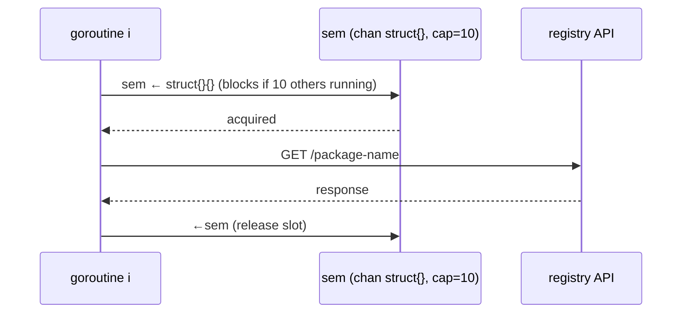

### Supported ecosystems

| Ecosystem | Registry | Latest version | Versions-behind |
|---|---|---|---|
| `npm` | `registry.npmjs.org/{pkg}` | `dist-tags.latest` | Count of versions between current and latest |
| `go` | `proxy.golang.org/{module}/@latest` + `@v/list` | `.Version` field | Count of listed versions newer than current |

---

## 6. Scorer package — risk formula and conflict detection

### Risk formula

Each dependency is scored across four independent signals.

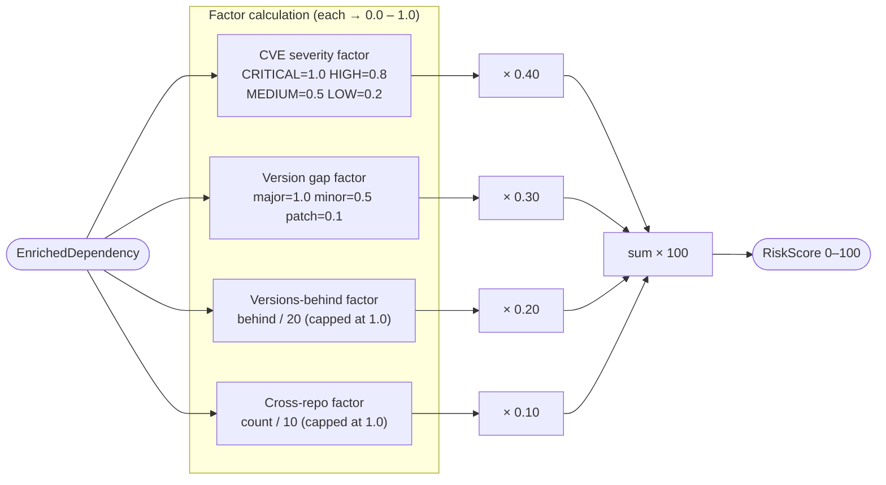

| Score | Band | Colour | Typical profile |
|---|---|---|---|
| 70–100 | Critical | Red / bold | CRITICAL or HIGH CVE present |
| 40–69 | Elevated | Yellow | Major version lag or HIGH CVE |
| 0–39 | Low | Green | Patch/minor lag, no CVEs |

### Conflict detection — `DetectConflicts`

A second pass over scored dependencies checks `PeerConstraints` (populated from npm registry metadata) against currently installed peer versions.

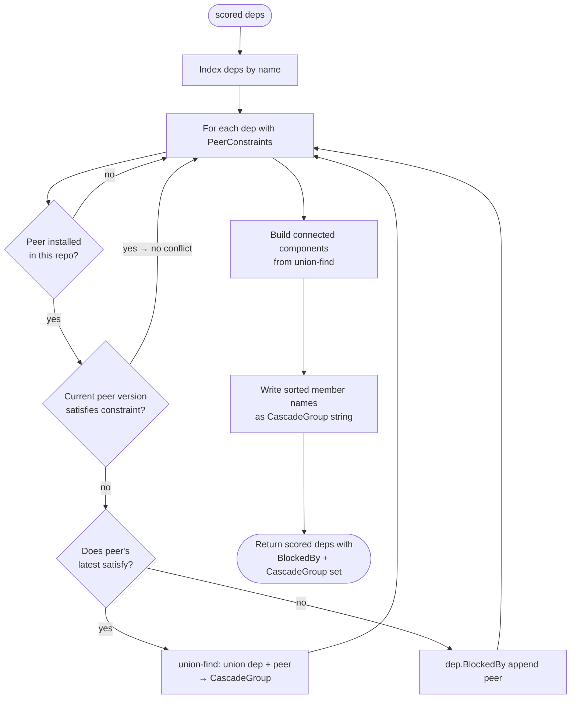

**Union-Find determinism:** the lexicographically smaller package name always becomes the root, so the cascade group ID (e.g. `"next+react"`) is identical regardless of traversal order.

**Two outcomes per conflict:**

| Outcome | Condition | Field set |
|---|---|---|
| `CascadeGroup` | Peer's *latest* satisfies the constraint — both can upgrade together | `CascadeGroup = "pkg-a+pkg-b"` on both members |
| `BlockedBy` | Even the peer's *latest* doesn't satisfy — no safe path exists yet | `BlockedBy = ["peer-name"]` on the blocked dep |

---

## 7. Advisor package

The advisor is designed for easy swapping between the stub and a real API-backed implementation.

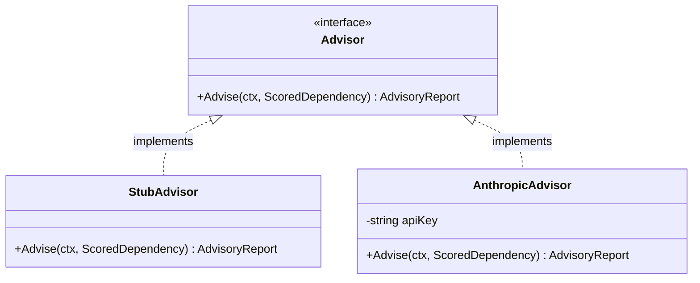

### Selection logic

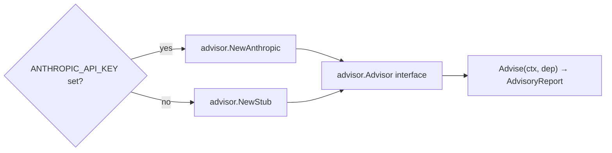

The stub generates deterministic guidance from metadata alone — no network calls:

- **Summary** — `"Upgrade {name} from {current} to {latest}. Risk score: {n}/100."`
- **BreakingChanges** — populated only for major-version gaps
- **MigrationSteps** — ecosystem-appropriate shell commands (`npm install`, `go get`, `pip install --upgrade`)

---

## 8. Pipeline package

`pipeline.Run()` is the single entry point for the full scan sequence. Both the CLI and the HTTP server call it, avoiding any duplication of orchestration logic.

```mermaid
flowchart TD
    A([pipeline.Run called]) --> B{GitURL set?}
    B -- yes --> C["git clone --depth 1 → tempDir\ninject GITHUB_TOKEN if HTTPS"]
    C --> D[dir = tempDir]
    B -- no --> D
    D --> E[scanner.Discover]
    E --> F{0 deps found?}
    F -- yes --> G([return nil, nil])
    F -- no --> H[resolver.Enrich]
    H --> I[scorer.Score]
    I --> J[scorer.DetectConflicts]
    J --> K[advisor.Advise loop]
    K --> L([return []AdvisoryReport])
    L --> M{GitURL was set?}
    M -- yes --> N[os.RemoveAll tempDir]
    M -- no --> O([done])
    N --> O
```

`Options.OnProgress` is a `func(string)` callback the caller can use to stream status lines. The CLI prints them to stderr with `→` prefix; the server passes `nil` (silently ignored).

---

## 9. Store package — SQLite persistence

`store.New(path)` opens (or creates) a SQLite database using `modernc.org/sqlite` (pure Go, no CGo required). WAL mode is enabled for concurrent read performance.

### Schema

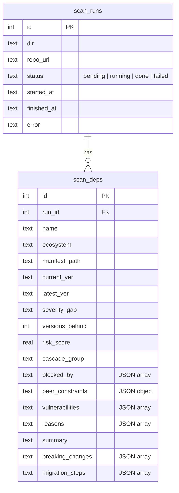

Array and object fields are stored as JSON strings and unmarshalled on read.

### Lifecycle

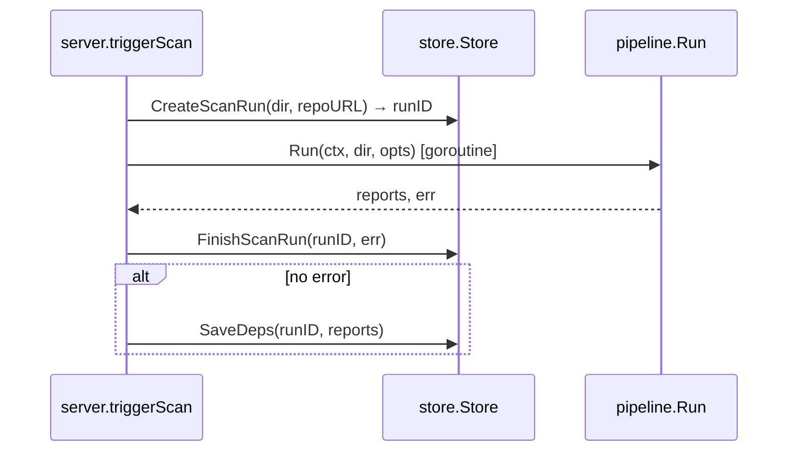

On startup, `RecoverStuckScans()` marks any runs still in `running` or `pending` state as `failed` — guarding against crash-interrupted scans leaving stale rows.

---

## 10. Server and dashboard

### HTTP routes

| Method | Path | Handler |
|---|---|---|
| `GET` | `/api/scans` | `listScans` — returns `[]store.ScanRun` |
| `GET` | `/api/scans/{id}` | `getScan` — returns `{run, deps}` |
| `POST` | `/api/scans` | `triggerScan` — 202 Accepted, scan runs in goroutine |
| `*` | `/*` | `spaHandler` — serves embedded React app, falls back to `index.html` |

### SPA fallback

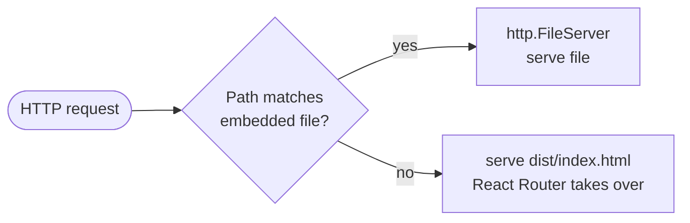

### Frontend architecture

The dashboard is a Vite + React 18 SPA embedded into the Go binary via `//go:embed dist`.

```
frontend/src/
├── main.jsx          ← ReactDOM root, BrowserRouter
├── App.jsx           ← Routes: / and /scans/:id
├── api.js            ← fetch wrappers for all API endpoints
├── index.css         ← dark-theme design system (CSS variables)
├── pages/
│   ├── ScanList.jsx  ← trigger form (local/remote toggle), scan history table
│   └── ScanDetail.jsx ← run metadata, deps table, migration hints
└── components/
    ├── RiskBadge.jsx    ← colour-coded score chip
    ├── StatusBadge.jsx  ← run status chip
    ├── DepsTable.jsx    ← sortable dependency table
    ├── CascadePanel.jsx ← cascade group visualisation
    └── BlockedPanel.jsx ← blocked upgrade warnings
```

`ScanList` and `ScanDetail` both poll the API every 2–3 seconds while a scan is in `running` state, updating automatically when it completes.

### Build and embed flow

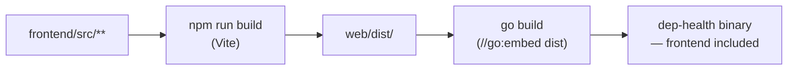

The `.gitignore` excludes `web/dist/*` (except `.gitkeep`) so the compiled assets are never committed — consumers build the frontend themselves.

---

## 11. External API contracts

### npm Registry

| | |
|---|---|
| **Endpoint** | `GET https://registry.npmjs.org/{package}` |
| **Auth** | None required for public packages |
| **Used fields** | `dist-tags.latest`, `versions` map (for counting + peer constraints) |
| **Peer constraints** | `versions[latest].peerDependencies` → `map[string]string` |
| **Rate limit** | Informal; 10-connection semaphore keeps dep-health well within normal bounds |

### Go Module Proxy

| | |
|---|---|
| **Latest endpoint** | `GET https://proxy.golang.org/{escaped-module}/@latest` |
| **List endpoint** | `GET https://proxy.golang.org/{escaped-module}/@v/list` |
| **Auth** | None for public modules |
| **Module escaping** | `golang.org/x/mod/module.EscapePath` (capital letters → `!lower`) |

### OSV.dev Batch API

| | |
|---|---|
| **Endpoint** | `POST https://api.osv.dev/v1/querybatch` |
| **Auth** | None |
| **Request** | `{"queries":[{"package":{"name":"lodash","ecosystem":"npm"},"version":"4.17.11"},…]}` |
| **Response** | `{"results":[{"vulns":[{"id":"GHSA-…","summary":"…","database_specific":{"severity":"HIGH"}}]}]}` |
| **Alignment** | `results[i]` corresponds exactly to `queries[i]` |
| **Severity source** | Prefer `database_specific.severity`; fall back to `severity[0].score` (CVSS string) |

---

## 12. Extension guide

### Adding a new ecosystem scanner

1. Create `scanner/yourscanner.go`
2. Implement the `Scanner` interface
3. Add it to `DefaultScanners()`

```go
// scanner/requirements.go
type RequirementsTxtScanner struct{}

func (s *RequirementsTxtScanner) Name() string               { return "python/requirements.txt" }
func (s *RequirementsTxtScanner) Matches(path string) bool   { return filepath.Base(path) == "requirements.txt" }
func (s *RequirementsTxtScanner) Parse(path, repoURL string) ([]models.Dependency, error) {
    // parse requirements.txt, return deps with Ecosystem: "pypi"
}
```

Then add a registry lookup branch in `resolver/resolver.go`:

```go
func (r *Resolver) resolveOne(ctx context.Context, dep models.Dependency) (models.EnrichedDependency, error) {
    switch dep.Ecosystem {
    case "npm":   return r.resolveNPM(ctx, dep)
    case "go":    return r.resolveGoProxy(ctx, dep)
    case "pypi":  return r.resolvePyPI(ctx, dep)   // add your implementation
    default:
        return models.EnrichedDependency{Dependency: dep}, nil
    }
}
```

### Wiring the real Anthropic advisor

```go
// advisor/anthropic.go
func (a *AnthropicAdvisor) Advise(ctx context.Context, dep models.ScoredDependency) (models.AdvisoryReport, error) {
    client := anthropic.NewClient(a.apiKey)

    prompt := buildPrompt(dep) // construct from dep metadata + CVE summaries

    msg, err := client.Messages.New(ctx, anthropic.MessageNewParams{
        Model:     anthropic.F(anthropic.ModelClaudeSonnet4_6),
        MaxTokens: anthropic.F(int64(1024)),
        Messages: anthropic.F([]anthropic.MessageParam{
            anthropic.NewUserMessage(anthropic.NewTextBlock(prompt)),
        }),
    })
    if err != nil {
        return models.AdvisoryReport{}, err
    }

    return parseAnthropicResponse(dep, msg.Content[0].Text), nil
}
```

See the `/claude-api` skill for a complete working example with the Anthropic Go SDK.
